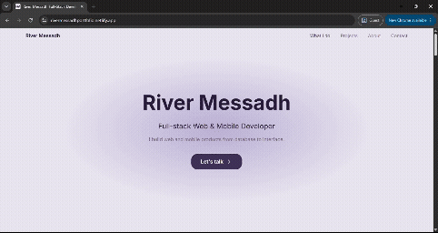

<div align="center">

# River Messadh — Portfolio

Full-stack developer portfolio built with Next.js. Showcases projects, tech stack, and background, with a working contact form.

**[Live Site →](https://rivermessadhportfolio.netlify.app/)**

 
</div>

---

## Features

- Fully responsive across desktop, tablet, and mobile
- Project showcase with modal detail views
- Tech stack grouped by Web/Backend, Mobile, and Tools
- Working contact form powered by Resend
- Custom design system driven entirely by CSS variables (no hardcoded styles)
- Respects `prefers-reduced-motion` for accessibility

## Tech Stack


## Getting Started

```bash
git clone https://github.com/riverimenemessadh/2026-portfolio.git
cd 2026-portfolio
npm install
```

Create a `.env.local` file in the root:

```
RESEND_API_KEY=your_resend_api_key_here
```

Run the dev server:

```bash
npm run dev
```

Open [http://localhost:3000](http://localhost:3000).

## Project Structure

```
/app          — routes, layout, and the contact API endpoint
/components   — layout, section, and UI components
/data         — site content (nav links, projects, stack, experience)
/public       — icons, images, screenshots
/styles       — global CSS variables and resets
```

## Contact

- [Portfolio](https://rivermessadhportfolio.netlify.app/)
- [LinkedIn](https://www.linkedin.com/in/river-messadh)
- [Upwork](https://www.upwork.com/freelancers/~017d459f20e3d30e04)
- [Email](mailto:sarahimenemessadh@gmail.com)
